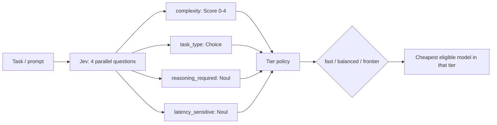
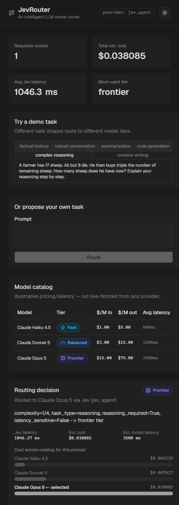

# JevRouter

An intelligent LLM model router. Given a task, it uses [Jev](https://typesafe.ai) to assess complexity, task type, reasoning requirement, and latency sensitivity — then routes to the cheapest model tier that can actually handle it, instead of hitting the most capable (and most expensive) model for every request.

```
task -> Jev: complexity / task_type / reasoning_required / latency_sensitive -> tier policy -> model
```

Second in the [Jev projects](../) series (after [JevGuard](../jev-guard)). Same conventions: FastAPI + Vite/React/shadcn, mock-first, zero cost by default.

## How it works



1. **Jev call** (`backend/app/questions.py`) — one request, four questions evaluated in parallel against the prompt:
   - `complexity` (**Score**, 5-level rubric: trivial → expert)
   - `task_type` (**Choice**: factual / conversation / summarization / code / creative / reasoning)
   - `reasoning_required` (**Noul**: needs multi-step reasoning, not just direct generation?)
   - `latency_sensitive` (**Noul**: interactive/chat-shaped, or batch-tolerant?)
2. **Tier policy** (`backend/app/policy.py`) — picks a target tier (fast/balanced/frontier) from those four signals, then the cheapest model in the catalog at that tier whose `max_complexity` and reasoning support actually cover the task, escalating a tier if nothing qualifies.
3. **Model catalog** (`backend/app/catalog.py`) — a small static table (3 illustrative Claude-tier models) with cost and latency. No downstream model is actually called — this router decides *which* model *would* handle the task and what that would cost, which is what the dashboard's cost comparison shows.

## Why Jev here

A regex or length-based router can catch the extremes (a one-word prompt is obviously simple, a 2,000-word prompt obviously isn't) but has no way to tell "explain your reasoning step by step" from "explain what this word means" — both look similar on the surface, one needs a much stronger model. That's a judgment call, and Jev returns four independent, calibrated judgments about the same prompt in a single parallel call, fast enough to run on every request rather than only the ones a keyword filter flagged.

## Providers

Same three-provider abstraction as JevGuard (`mock` default / `typesafe` / `jev_agent` — see [JevGuard's README](../jev-guard/README.md#providers) for the full breakdown of what each needs and costs). The deployed public demo stays on `mock`.

## Demo tasks

Seeded in `backend/app/fixtures.py`, one per category, deliberately spanning all three tiers:

| Category | Lands on |
|---|---|
| factual lookup, casual conversation, summarization, creative writing | **fast** |
| code generation | **balanced** |
| complex reasoning | **frontier** |

## Setup

```bash
cp .env.example .env   # defaults to JEV_PROVIDER=mock, no key needed

# backend
cd backend
python -m venv .venv && .venv/Scripts/activate  # .venv/bin/activate on macOS/Linux
pip install -r requirements.txt
uvicorn app.main:app --reload --port 8000

# frontend (separate shell)
cd frontend
npm install
npm run dev
```

Or via Docker Compose from the project root:

```bash
docker compose up --build
```

Dashboard at `http://localhost:5174` (or `5173` outside Docker's default mapping — check `docker-compose.yml`), API at `http://localhost:8001` (host) / `8000` (in-container).

## Tests

```bash
cd backend
pytest
```

Covers the tier policy's routing decisions (including that a fast/latency-sensitive task never lands on a reasoning-incapable model) and the mock provider's task-classification heuristics.

## Deployment

Deploys as a single Vercel project — import this repo, no configuration needed. `vercel.json` sets `buildCommand`/`outputDirectory` for the Vite frontend (Vercel's documented convention: the output directory's contents serve at the site root) and `framework: null` to stop any dashboard-detected framework preset from interfering, regardless of what's shown in the project's own Settings. `api/index.py` is auto-detected as a Python serverless function independent of the static build config — zero extra configuration needed for that part.

Several things that took a few iterations to get right, worth knowing if you fork this:
- **`api/app` is a real copy of `backend/app`, not an import across directories.** Vercel's Python bundler doesn't reliably include files outside a function's own directory, and a `sys.path` reach into the sibling `backend/` folder was the actual cause of an early deploy's 500 errors. Run `scripts/sync-api.sh` after changing anything in `backend/app/` and before deploying.
- **`api/index.py` explicitly adds its own directory to `sys.path`.** Vercel loads it via `importlib`, not as a directly-run script — Python doesn't auto-add the file's own directory to the path for that loading mechanism. A local test can pass anyway if it happens to run from within `api/` (the shell's cwd fills the gap `importlib` doesn't), which is exactly how an earlier local verification gave a false pass.
- **`framework: null` in `vercel.json`, explicitly.** A dashboard-auto-detected Framework Preset can silently override `buildCommand`/`outputDirectory` even after they're set in `vercel.json` — the leading suspect for the root URL 404ing while `/api/*` worked fine on an earlier deploy attempt. Setting `framework: null` forces `vercel.json` to be authoritative regardless of what the project's own Settings page shows.
- **Only `pyproject.toml` for the deployed function — no `requirements.txt` at the root or in `api/`.** Both a `.python-version` file and `pyproject.toml`'s `requires-python` were ignored as long as a `requirements.txt` sat next to them — dependency resolution apparently took the `requirements.txt` path and never consulted `pyproject.toml` for anything, version pin included, defaulting to a Python version too new for a pinned dependency's compiled wheels. Removing `requirements.txt` for the deployed function entirely (kept in `backend/` for local dev/Docker, untouched) and listing dependencies directly in `pyproject.toml` is what made `requires-python` take effect.
- **`vercel.json`'s `build.env.PYO3_USE_ABI3_FORWARD_COMPATIBILITY=1`** is kept as a safety net even with the version pin working — harmless when the pinned version already has a prebuilt wheel (no compilation happens at all in that case).
- **`config.py` treats a present-but-empty env var the same as an unset one.** `os.environ.get(key, default)` only falls back when the key is missing entirely; a blank value (e.g. an env var added in the Vercel dashboard with no value typed in) passes straight through to whatever consumes it. Confirmed via a real production crash on this pattern, not hypothetical.

`api/index.py` mounts the app under `/api` with zero route changes in `app/main.py` itself, so the frontend's relative `/api/*` calls work on the same domain with no separate API URL to configure.

Defaults to `JEV_PROVIDER=mock` (no environment variables required to deploy). To run the deployed demo against a real Jev key, set `TYPESAFE_API_KEY` or `JEV_AGENT_KEY` and `JEV_PROVIDER` in the Vercel project's environment variables — see `.env.example`.

No persistence needed — the decision log is in-memory/demo-only.

## Screenshots

**Demo flow** — routing a factual question (fast/Haiku), a code-generation task (balanced/Sonnet), and a multi-step reasoning problem (frontier/Opus), each with its live cost comparison:


**Dashboard:**


**Routing decision detail**, with the raw typed Jev answers expanded:


**Live Jev output** — `JEV_PROVIDER=jev_agent` against the real API (not mock), routing a complex-reasoning prompt (the farmer/sheep river-crossing puzzle) to the frontier tier via Claude Opus 5, with real ~1046ms latency and the actual `complexity=1/4, task_type=reasoning, reasoning_required=True, latency_sensitive=False` signals Jev returned:



## Limitations

- Catalog prices/latencies are illustrative placeholders, not live-fetched from any provider — edit `backend/app/catalog.py` before trusting the numbers for anything real.
- No downstream model is actually called; this only decides *which* model would be used.
- Mock provider's task classification is keyword-based, not a real model — good enough to demo the architecture and exercise all three tiers, not a claim about real Jev's accuracy.
- Decision log is in-memory and resets on restart/cold start.
