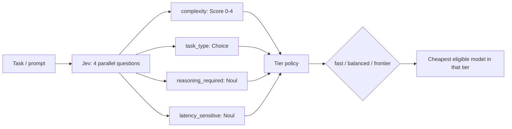
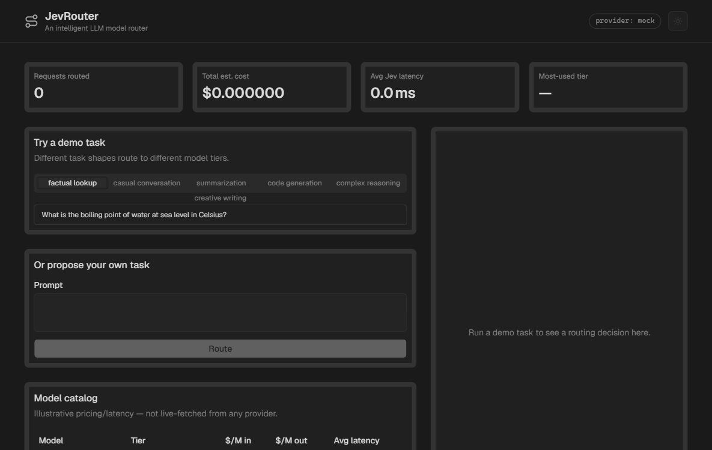
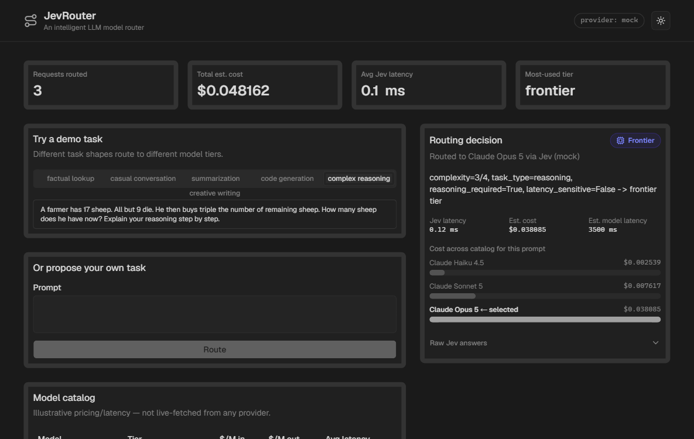
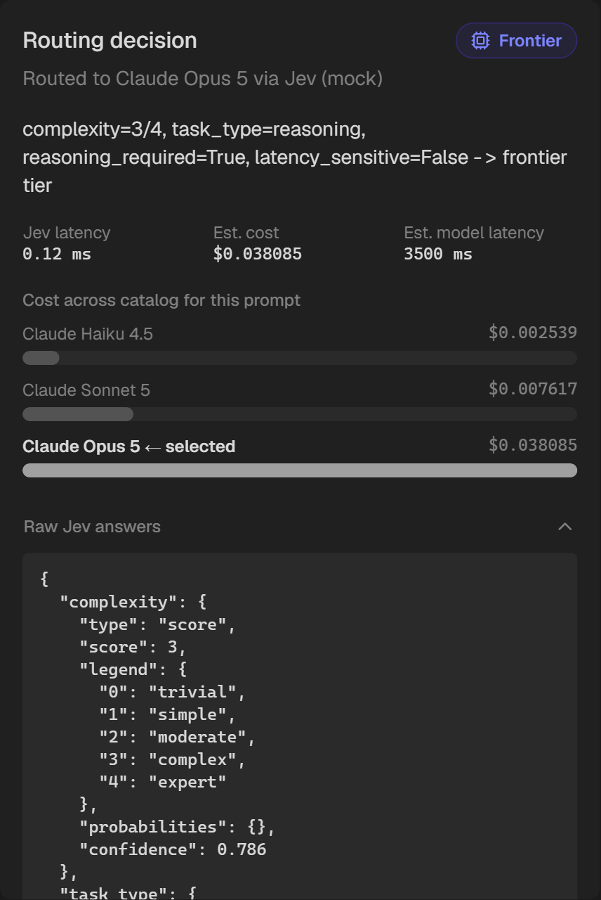

# JevRouter

An intelligent LLM model router. Given a task, it uses [Jev](https://typesafe.ai) to assess complexity, task type, reasoning requirement, and latency sensitivity — then routes to the cheapest model tier that can actually handle it, instead of hitting the most capable (and most expensive) model for every request.

```
task -> Jev: complexity / task_type / reasoning_required / latency_sensitive -> tier policy -> model
```

Second in the [Jev projects](../) series (after [JevGuard](../jev-guard)). Same conventions: FastAPI + Vite/React/shadcn, mock-first, zero cost by default.

## How it works



1. **Jev call** (`backend/app/questions.py`) — one request, four questions evaluated in parallel against the prompt:
   - `complexity` (**Score**, 5-level rubric: trivial → expert)
   - `task_type` (**Choice**: factual / conversation / summarization / code / creative / reasoning)
   - `reasoning_required` (**Noul**: needs multi-step reasoning, not just direct generation?)
   - `latency_sensitive` (**Noul**: interactive/chat-shaped, or batch-tolerant?)
2. **Tier policy** (`backend/app/policy.py`) — picks a target tier (fast/balanced/frontier) from those four signals, then the cheapest model in the catalog at that tier whose `max_complexity` and reasoning support actually cover the task, escalating a tier if nothing qualifies.
3. **Model catalog** (`backend/app/catalog.py`) — a small static table (3 illustrative Claude-tier models) with cost and latency. No downstream model is actually called — this router decides *which* model *would* handle the task and what that would cost, which is what the dashboard's cost comparison shows.

## Why Jev here

A regex or length-based router can catch the extremes (a one-word prompt is obviously simple, a 2,000-word prompt obviously isn't) but has no way to tell "explain your reasoning step by step" from "explain what this word means" — both look similar on the surface, one needs a much stronger model. That's a judgment call, and Jev returns four independent, calibrated judgments about the same prompt in a single parallel call, fast enough to run on every request rather than only the ones a keyword filter flagged.

## Providers

Same three-provider abstraction as JevGuard (`mock` default / `typesafe` / `jev_agent` — see [JevGuard's README](../jev-guard/README.md#providers) for the full breakdown of what each needs and costs). The deployed public demo stays on `mock`.

## Demo tasks

Seeded in `backend/app/fixtures.py`, one per category, deliberately spanning all three tiers:

| Category | Lands on |
|---|---|
| factual lookup, casual conversation, summarization, creative writing | **fast** |
| code generation | **balanced** |
| complex reasoning | **frontier** |

## Setup

```bash
cp .env.example .env   # defaults to JEV_PROVIDER=mock, no key needed

# backend
cd backend
python -m venv .venv && .venv/Scripts/activate  # .venv/bin/activate on macOS/Linux
pip install -r requirements.txt
uvicorn app.main:app --reload --port 8000

# frontend (separate shell)
cd frontend
npm install
npm run dev
```

Or via Docker Compose from the project root:

```bash
docker compose up --build
```

Dashboard at `http://localhost:5174` (or `5173` outside Docker's default mapping — check `docker-compose.yml`), API at `http://localhost:8001` (host) / `8000` (in-container).

## Tests

```bash
cd backend
pytest
```

Covers the tier policy's routing decisions (including that a fast/latency-sensitive task never lands on a reasoning-incapable model) and the mock provider's task-classification heuristics.

## Deployment

Same shape as JevGuard: Vite static build for the frontend, FastAPI as Vercel Python serverless functions for the backend. No persistence needed — the decision log is in-memory/demo-only.

## Screenshots

**Demo flow** — routing a factual question (fast/Haiku), a code-generation task (balanced/Sonnet), and a multi-step reasoning problem (frontier/Opus), each with its live cost comparison:



**Dashboard:**



**Routing decision detail**, with the raw typed Jev answers expanded:



## Limitations

- Catalog prices/latencies are illustrative placeholders, not live-fetched from any provider — edit `backend/app/catalog.py` before trusting the numbers for anything real.
- No downstream model is actually called; this only decides *which* model would be used.
- Mock provider's task classification is keyword-based, not a real model — good enough to demo the architecture and exercise all three tiers, not a claim about real Jev's accuracy.
- Decision log is in-memory and resets on restart/cold start.
